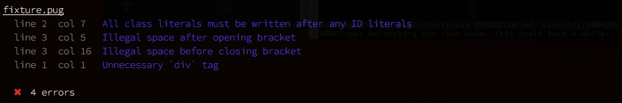
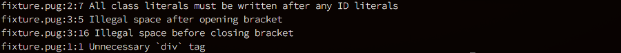

# puglint-stylish [![Build Status][travis-image]][travis-url] [![NPM version][npm-image]][npm-url]

[][screenshot-image] [![Dependency Status][depstat-image]][depstat-url] [![devDependency Status][devdepstat-image]][devdepstat-url]

> Stylish Reporter for [pug-lint](https://github.com/pugjs/pug-lint).
Heavily inspired by [jshint-stylish](https://github.com/sindresorhus/jshint-stylish).



Compared to the default reporter:



## Install

Install with [npm](https://npmjs.org/package/puglint-stylish): `npm install --save-dev puglint-stylish`.

## Usage

### pug-lint CLI

> Requires `pug-lint@>=1.2 <3.0.0`

```sh
$ pug-lint --reporter node_modules/puglint-stylish [options] <file ...>
```

## License

[BSD-3-Clause](https://raw.githubusercontent.com/aranasoft/puglint-stylish/master/LICENSE) © [Arana Software](http://www.aranasoft.com)

[screenshot-image]: https://github.com/aranasoft/puglint-stylish/blob/master/screenshot-stylish.png

[npm-url]: https://npmjs.org/package/puglint-stylish
[npm-image]: http://img.shields.io/npm/v/puglint-stylish.svg

[travis-url]: http://travis-ci.org/aranasoft/puglint-stylish
[travis-image]: https://travis-ci.org/aranasoft/puglint-stylish.svg?branch=master

[depstat-url]: https://david-dm.org/aranasoft/puglint-stylish
[depstat-image]: https://david-dm.org/aranasoft/puglint-stylish.svg

[devdepstat-url]: https://david-dm.org/aranasoft/puglint-stylish#info=devDependencies
[devdepstat-image]: https://david-dm.org/aranasoft/puglint-stylish/dev-status.svg
